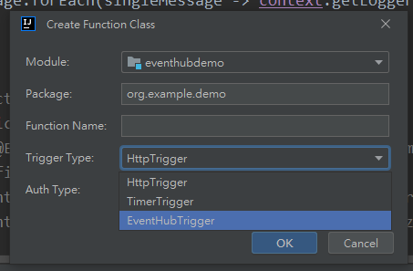

## eventhub trigger demo

* 新建class 選擇azure function class，trigger方式自選會先帶入對應範例()
* 範例中@EventHubTrigger eventHubName => Defines the name of the event hub 
* connection => Azure Eventhub connection string

測試可使用vscode plug-in :Azure Event Hub Explorer送出event message

參考資料:
- [Azure Event Hubs trigger for Azure Functions](https://docs.microsoft.com/en-us/azure/azure-functions/functions-bindings-event-hubs-trigger?tabs=in-process%2Cfunctionsv2%2Cextensionv5&pivots=programming-language-java#connection-string)
- [Azure Event Hubs trigger and bindings for Azure Functions](https://docs.microsoft.com/en-us/azure/azure-functions/functions-bindings-event-hubs?tabs=in-process%2Cextensionv5&pivots=programming-language-java)
- [Code and test Azure Functions locally](https://docs.microsoft.com/en-us/azure/azure-functions/functions-develop-local#local-settings-file)
- [10分钟实现Azure Function 通过IoT Hub Trigger处理设备到云的消息](https://www.51azure.cloud/post/2020/6/7/azure-iot-hub-azure-function-iot-hub-trigger-java)